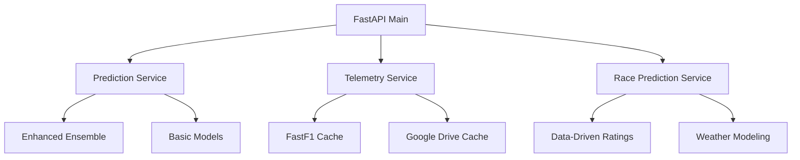

# F1 Insight Hub - Backend API

FastAPI backend providing F1 race predictions, telemetry analysis, and comprehensive race data through machine learning models and real-time telemetry processing.

## 🏎️ Features

### **🤖 Machine Learning Predictions**
- **Enhanced Ensemble Models**: XGBoost + Random Forest + Neural Networks with Optuna optimization
- **Advanced Feature Engineering**: Driver momentum, championship pressure, tire degradation modeling
- **Multi-Model Architecture**: Basic scikit-learn models + Enhanced ensemble system
- **Data-Driven Ratings**: Performance calculated from 718+ historical race records (2024-2025)
- **Weather Modeling**: 9 weather conditions with driver-specific wet weather performance
- **Time-Series Features**: 3-lap and 5-lap momentum indicators for form analysis

### **📊 Telemetry Analysis**
- **FastF1 Integration**: Real telemetry data from 2024-2025 seasons with comprehensive corner annotations
- **Multi-Variable Analysis**: Speed, throttle, brake, gear, RPM, DRS, tire data with overlap visualization
- **Session Support**: Practice (FP2, FP3), Qualifying (Q, SQ), Sprint (S), Race (R) with session-specific insights
- **Interactive Track Maps**: Speed-colored racing lines with real-time playback
- **Driver Comparisons**: Side-by-side telemetry analysis with gap calculations
- **Weather Context**: Integration with session weather conditions and track temperature
- **Google Drive Cache**: Pre-cached telemetry for sub-200ms response times

### **🏁 Race Predictions**
- **Individual Driver Predictions**: Position and confidence scoring with enhanced feature engineering
- **Full Grid Predictions**: Complete 20-driver race results with gap-to-winner estimates
- **Car Performance Priority**: 70% car, 30% driver with dynamic team performance modeling
- **Strategy & Reliability**: Pit stop strategy optimization and DNF probability modeling
- **Hyperparameter Optimization**: Optuna-tuned models for maximum accuracy
- **Enhanced Confidence Scoring**: Multi-model variance analysis for prediction reliability

## 🚀 Quick Start

### Local Development

```bash
# 1. Install dependencies
pip install -r requirements.txt

# 2. Download F1 data (uses Google Drive cache)
python download_current_data.py

# 3. (Optional) Train enhanced ML models
python enhanced_ml_model.py

# 4. Run the server
python main.py
# Server starts at http://localhost:8000
```

### Production Deployment

#### Option 1: Fly.io (Recommended - 10GB image support)

```bash
# Install Fly CLI
curl -L https://fly.io/install.sh | sh

# Deploy
cd backend
fly launch --name your-f1-backend
fly deploy --remote-only
```

#### Option 2: Railway (4GB limit)

```bash
# Connect to Railway
railway login
railway init

# Deploy
railway up
```

#### Option 3: DigitalOcean App Platform

```bash
# Use the optimized Dockerfile
# Image size: ~500MB (basic) or ~4GB (enhanced ML)
```

## 📦 Deployment Configurations

### Basic Deployment (Lightweight - ~500MB)

Uses `requirements-base.txt` - includes essential prediction models without TensorFlow/PyTorch:

```bash
# Dockerfile uses requirements-base.txt
# Excludes enhanced ML models for smaller image size
```

**Features Available:**
- ✅ Race predictions (XGBoost + Random Forest)
- ✅ Telemetry analysis 
- ✅ All API endpoints
- ✅ Google Drive cache integration

### Enhanced Deployment (Full ML - ~4GB)

Uses `requirements.txt` - includes all ML models with TensorFlow/PyTorch:

```bash
# Dockerfile uses full requirements.txt
# Includes enhanced ensemble models
```

**Additional Features:**
- ✅ Neural Network models
- ✅ Enhanced ensemble predictions
- ✅ Advanced hyperparameter optimization

## 🔌 API Endpoints

### Core Prediction APIs

#### `POST /api/predict/driver`
Individual driver performance prediction:

```bash
curl -X POST "http://localhost:8000/api/predict/driver" \
  -H "Content-Type: application/json" \
  -d '{
    "driver": "VER",
    "track": "Monaco Grand Prix", 
    "weather": "Dry",
    "team": "Red Bull"
  }'
```

#### `POST /api/predict/race`
Full race grid prediction:

```bash
curl -X POST "http://localhost:8000/api/predict/race" \
  -H "Content-Type: application/json" \
  -d '{
    "race_name": "Austrian Grand Prix",
    "weather": "Light Rain",
    "temperature": 18.0,
    "qualifying_results": {
      "VER": 1, "NOR": 2, "LEC": 3
    }
  }'
```

### Telemetry Analysis APIs

#### `GET /api/telemetry/available-sessions/{year}`
Get available races and sessions for a specific year:

```bash
curl "http://localhost:8000/api/telemetry/available-sessions/2024"
```

#### `POST /api/telemetry/analyze`
Comprehensive session telemetry analysis with performance metrics:

```bash
curl -X POST "http://localhost:8000/api/telemetry/analyze" \
  -H "Content-Type: application/json" \
  -d '{
    "year": 2024,
    "race": "Austrian Grand Prix",
    "session": "Q",
    "drivers": ["VER"]
  }'
```

#### `POST /api/telemetry/speed-trace`
Detailed lap telemetry with corner annotations:

```bash
curl -X POST "http://localhost:8000/api/telemetry/speed-trace" \
  -H "Content-Type: application/json" \
  -d '{
    "year": 2024,
    "race": "Austrian Grand Prix",
    "driver": "VER",
    "session": "Q",
    "lap_number": 1
  }'
```

#### `POST /api/telemetry/track-map`
Interactive track map with speed-colored racing line:

```bash
curl -X POST "http://localhost:8000/api/telemetry/track-map" \
  -H "Content-Type: application/json" \
  -d '{
    "year": 2024,
    "race": "Austrian Grand Prix",
    "driver": "VER",
    "session": "Q",
    "lap_number": 1
  }'
```

#### `POST /api/telemetry/driver-comparison`
Side-by-side driver telemetry comparison:

```bash
curl -X POST "http://localhost:8000/api/telemetry/driver-comparison" \
  -H "Content-Type: application/json" \
  -d '{
    "year": 2024,
    "race": "Austrian Grand Prix",
    "driver1": "VER",
    "driver2": "NOR",
    "session": "Q",
    "lap_type": "fastest"
  }'
```

### Health & Status

#### `GET /health`
Server health and feature availability:

```bash
curl "http://localhost:8000/health"
```

Response:
```json
{
  "status": "healthy",
  "enhanced_ml": true,
  "telemetry_available": true
}
```

## 🏗️ Architecture

### File Structure

```
backend/
├── main.py                              # FastAPI server with all endpoints
├── f1_data.csv                          # Historical race data (718+ records)
├── download_current_data.py             # Google Drive data loader
├── google_drive_data_loader.py          # Google Drive cache utilities
├── enhanced_ml_model.py                 # Enhanced ensemble model training
├── train_ml_model.py                    # Original model training script
├── model_training.log                   # Training performance logs
├── requirements.txt                     # Full dependencies (with ML)
├── requirements-base.txt                # Basic dependencies (lightweight)
├── Dockerfile                           # Optimized for cloud deployment
├── fly.toml                            # Fly.io configuration
├── services/
│   ├── prediction_service.py               # Basic ML predictions
│   ├── enhanced_ensemble_service.py        # Advanced ensemble models
│   ├── enhanced_prediction_service.py      # Enhanced individual predictions
│   ├── race_prediction_service.py          # Full race grid predictions
│   ├── telemetry_analyzer_service.py       # Telemetry processing
│   └── data_service.py                     # Data utilities
├── models/                              # Basic prediction models
│   ├── f1_qualifying_gbm_model.pkl
│   ├── f1_race_gbm_model.pkl
│   └── *.pkl                            # Scalers and encoders
├── enhanced_models/                     # Enhanced ensemble models
│   ├── qualifying_ensemble.pkl
│   ├── race_ensemble.pkl  
│   ├── qualifying_neural_network.pkl
│   ├── race_neural_network.pkl
│   └── *.pkl                            # Enhanced features & scalers
└── cache/                               # FastF1 telemetry cache
    ├── 2024/                            # Complete 2024 season
    ├── 2025/                            # 2025 season data
    └── fastf1_http_cache.sqlite         # HTTP cache database
```

### Service Architecture



## 🌤️ Weather Conditions

### Basic Conditions
- **Dry**: Normal racing conditions
- **Light Rain**: Slight wet conditions
- **Heavy Rain**: Challenging wet conditions  
- **Wet**: Full wet racing

### Mixed/Changing Conditions
- **Mixed**: Variable conditions throughout race
- **Dry → Light Rain**: Strategy critical
- **Light Rain → Dry**: Tire timing crucial
- **Dry → Heavy Rain**: High uncertainty
- **Variable**: Maximum unpredictability

## 🏎️ 2025 F1 Grid Support

**All 20 Drivers & Teams:**
- Red Bull, McLaren, Ferrari, Mercedes
- Aston Martin, Alpine, RB, Williams
- Haas, Kick Sauber
- Includes accurate 2025 transfers (Hamilton → Ferrari, etc.)

**All 24 Circuits:**
- Complete 2025 F1 calendar support
- Track-specific performance modeling

## 📈 Model Performance

### Enhanced Prediction Accuracy
- **Qualifying MAE**: 0.359 positions (excellent) - Enhanced ensemble models
- **Race MAE**: 1.638 positions (very good) - Significant improvement over baseline
- **Training Data**: 718 race records from 2024-2025 seasons
- **Model Optimization**: Optuna hyperparameter tuning with 50+ trials per model
- **Ensemble Performance**: 3-model voting system (XGBoost + RF + Neural Network)

### Advanced Feature Engineering Impact
- **Driver Momentum**: 3-lap and 5-lap trend analysis
- **Championship Pressure**: Position-based performance modeling
- **Team Dynamics**: Teammate comparison features
- **Track Specialization**: Circuit-specific driver advantages
- **Weather Modeling**: Enhanced wet weather performance indicators

### Telemetry Performance
- **Session Types**: 6 supported (FP2, FP3, SQ, Q, S, R) with session-specific analysis
- **Cache Size**: ~4GB compressed telemetry data with Google Drive integration
- **Response Time**: <200ms with optimized cache system
- **Data Coverage**: Complete 2024 season + partial 2025 season
- **Corner Detection**: Automated track corner identification and annotations

### Weather Impact Modeling
- **Dry Conditions**: 80-95% confidence with stable predictions
- **Mixed Conditions**: 60-80% confidence with realistic uncertainty modeling
- **Driver-Specific**: Enhanced wet weather performance for Hamilton, Verstappen, Gasly
- **Temperature Effects**: Track temperature impact on tire performance

## 🔧 Configuration

### Environment Variables

```bash
# Google Drive Cache (recommended)
GOOGLE_DRIVE_CACHE_FILE_ID=your_drive_file_id

# Optional: API Configuration
API_HOST=0.0.0.0
API_PORT=8000
```

### Google Drive Setup

1. Upload FastF1 cache to Google Drive
2. Make the file publicly shareable
3. Extract file ID from share URL
4. Set `GOOGLE_DRIVE_CACHE_FILE_ID` environment variable

### Docker Configuration

```dockerfile
# Lightweight deployment (500MB)
COPY requirements-base.txt .

# Full ML deployment (4GB)  
COPY requirements.txt .
```

## 🛠️ Development

### Adding New Features

1. **New Prediction Model**: Add to `services/`
2. **New Telemetry Analysis**: Extend `telemetry_analyzer_service.py`
3. **New API Endpoint**: Add to `main.py`

### Testing

```bash
# Test basic predictions
python -c "from services.prediction_service import PredictionService; print(PredictionService().predict_race_position('VER', 'Monaco Grand Prix', 'Dry', 'Red Bull'))"

# Test telemetry
python -c "from services.telemetry_analyzer_service import TelemetryAnalyzerService; print(TelemetryAnalyzerService().get_available_sessions())"
```

### Performance Optimization

- **Cache Strategy**: Google Drive for telemetry, local for predictions
- **Model Loading**: Lazy loading for enhanced models
- **API Response**: Async endpoints for better concurrency

## 🚀 Production Tips

### Scaling

- **Horizontal**: Deploy multiple instances behind load balancer
- **Vertical**: Increase memory for enhanced ML models (recommend 2GB+)
- **Caching**: Use Redis for frequent prediction requests

### Monitoring

- **Health Checks**: `/health` endpoint for container orchestration
- **Logging**: Structured logging for telemetry requests
- **Metrics**: Track prediction accuracy and response times

### Security

- **CORS**: Configured for frontend integration
- **Environment Variables**: Never commit API keys
- **Input Validation**: Pydantic models for all requests